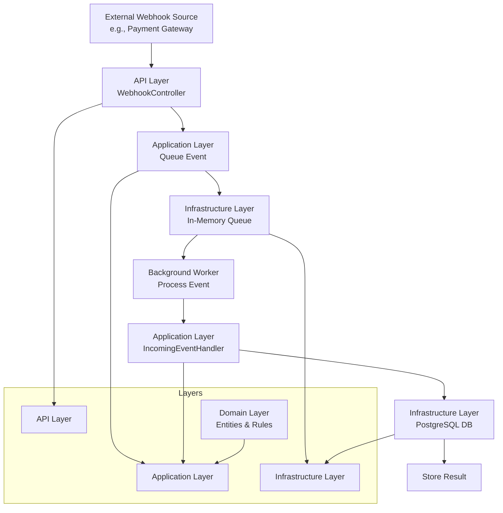
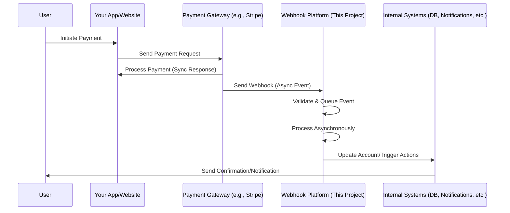

# Webhook Processing Platform

A .NET-based platform for receiving, queuing, and asynchronously processing webhooks, with a focus on payment gateway integrations (e.g., Stripe-like services). Built to demonstrate layered architecture, event-driven design, and coding patterns like Repository, Adapter, and Builder.

## Features

✅ **Webhook Signature Validation** - Validates incoming webhooks using HMAC-SHA256 signature verification  
✅ **Event Queuing** - In-memory queue for development; abstraction allows Redis in production  
✅ **Asynchronous Processing** - Background service continuously processes queued events without blocking the API  
✅ **Database Persistence** - Stores processed payments in PostgreSQL with duplicate detection  
✅ **Data Validation** - Input validation on all DTOs with meaningful error messages  
✅ **Error Handling** - Graceful error handling with proper logging  
✅ **Comprehensive Tests** - 35+ unit tests covering all major components  
✅ **Layered Architecture** - Clean separation of concerns across API, Application, Domain, and Infrastructure layers

## Architecture Overview

- **Layered Architecture**: Separates API, Application, Domain, and Infrastructure layers for maintainability.
- **Event-Driven**: Webhooks trigger events that are queued and processed in the background.
- **Async Processing**: Uses background workers to handle high-volume webhook events without blocking.
- **Queue Abstraction**: `IWebhookQueue` interface allows switching between in-memory and Redis implementations.
- **Patterns**: Repository for data access, Adapter for external integrations, Builder for object construction.

### High-Level Architecture Diagram



This diagram shows the flow of a webhook from receipt to storage, with layers for separation of concerns. The key difference from traditional sync processing is the Queue and Background Worker, which enable async event handling.

## Role in Larger Systems

This webhook processing platform acts as a middleware component in distributed systems, particularly in e-commerce, fintech, or SaaS applications. It bridges external services (e.g., payment gateways) with internal systems, ensuring reliable event handling without coupling.

### Example: Payment Processing System



This sequence shows how the webhook platform integrates as middleware, handling async events from external services while your main app focuses on user interactions.

In a complete system, this platform reduces load on main APIs, enables scalability, and provides audit trails. It can integrate with microservices via APIs or message buses.

## Technologies

- .NET Web API
- PostgreSQL (for storing results)
- Redis (for queuing; in-memory for development)
- Docker (for containerization)

## Configuration & Secrets

**⚠️ Important:** Never commit sensitive data to version control. This project uses:

- **User Secrets** (`dotnet user-secrets`) for local development - stored securely outside the repo
- **Environment Variables** for production deployments
- **appsettings.json.example** - template showing the required configuration structure

See the Setup section below for how to configure your local environment.

## Setup

1. **Clone the repository:**

   ```bash
   git clone <repository-url>
   cd webhook_processing_platform
   ```

2. **Install .NET 10.0 SDK** from [dotnet.microsoft.com](https://dotnet.microsoft.com)

3. **Set up PostgreSQL and Redis** (via Docker or locally)

4. **Configure local secrets:**
   - Copy `appsettings.json.example` to understand the structure
   - Use .NET User Secrets for local development (secrets are NOT committed to git):
     ```bash
     dotnet user-secrets init
     dotnet user-secrets set "ConnectionStrings:DefaultConnection" "Host=localhost;Database=postgres;Username=postgres;Password=your-password;SSL Mode=Require;Trust Server Certificate=true"
     dotnet user-secrets set "WebhookSignatureSecret" "your-webhook-secret-here"
     ```
   - Or set environment variables in your shell/IDE for the same keys

5. **Run database migrations:**
   ```bash
   dotnet ef database update
   ```

## Running the Application

1. Build and run the API:

   ```bash
   dotnet run
   ```

2. Send test webhooks to `/webhook/incoming` (use tools like Postman or curl)

3. Monitor background processing and stored results via logs or database queries

## Implementation Details

### Queue System

The platform implements a **queue abstraction** (`IWebhookQueue`) that allows flexible backend selection:

- **Development**: `InMemoryWebhookQueue` uses .NET's `ConcurrentQueue` for safe, in-memory event queuing
- **Production**: Can be swapped to Redis-based implementation without changing API code

**Key Features:**

- FIFO (First In, First Out) ordering
- Thread-safe enqueue/dequeue operations
- Queue size monitoring for metrics

### Background Processing

The `WebhookProcessingBackgroundService` is a `BackgroundService` that runs continuously:

1. Polls the queue every second
2. Dequeues messages and processes them via `IIncomingEventHandler`
3. Handles exceptions gracefully without stopping the service
4. Logs all operations for audit trails

**Error Handling:**

- **ArgumentException**: Invalid event types are logged as warnings
- **DuplicatePaymentException**: Duplicate events are caught and logged (idempotency)
- **Other Exceptions**: Logged as errors without retry (configurable for production)

### Data Validation

All DTOs include comprehensive validation attributes:

```csharp
public sealed record IncomingMessage
{
    [Required]
    [StringLength(100, MinimumLength = 1)]
    public string EventType { get; init; }

    [Required]
    [Range(0.01, double.MaxValue)]
    public double Amount { get; init; }
    // ...
}
```

The `WebhookController` validates messages before queuing:

```csharp
var validationResults = new List<ValidationResult>();
if (!Validator.TryValidateObject(incomingMessage, validationContext, validationResults, true))
{
    return BadRequest($"Validation failed: {string.Join("; ", validationResults)}");
}
```

### Database Layer

The `PaymentRepository` uses **Dapper** for high-performance data access:

- **Duplicate Detection**: Primary key on `payment_id` prevents duplicate payments
- **Retry Logic**: Exponential backoff for transient network errors
- **Connection Pooling**: `NpgsqlDataSource` provides efficient connection management
- **Query Performance**: Indexes on `order_id` and `status` for fast lookups

```sql
CREATE UNIQUE INDEX ux_webhook_payments_payment_id ON webhook_schema.payments(payment_id);
CREATE INDEX idx_webhook_payments_order_id ON webhook_schema.payments(order_id);
CREATE INDEX idx_webhook_payments_status ON webhook_schema.payments(status);
```

### Testing

Comprehensive test suite with **35 unit tests** covering:

- ✅ Queue operations (enqueue, dequeue, FIFO order)
- ✅ Event handler logic (validation, mapping, persistence)
- ✅ Signature validation (edge cases, timing attacks)
- ✅ Data mapping (field conversion, defaults)
- ✅ Background service lifecycle
- ✅ Exception handling and error propagation

**Test Types:**

- **Unit Tests**: Isolated component testing with mocks
- **Integration Tests**: Service lifecycle and interaction testing
- **Edge Case Tests**: Null checks, empty inputs, boundary conditions

### API Endpoints

**POST `/webhook/incoming`**

- **Request Body**: JSON payload with event data
- **Header**: `X-Signature` - HMAC-SHA256 signature of the payload
- **Response**:
  - `202 Accepted`: Event queued successfully
  - `400 Bad Request`: Invalid JSON or validation failure
  - `401 Unauthorized`: Invalid signature
  - `409 Conflict`: Duplicate event (idempotent)
  - `500 Internal Server Error`: Unexpected error

**GET `/health`**

- **Response**: `200 OK` with database connectivity status

### Dependency Injection

All services are registered in `Program.cs`:

```csharp
// Queue (single instance - shared across app)
builder.Services.AddSingleton<IWebhookQueue, InMemoryWebhookQueue>();

// Background service (long-lived)
builder.Services.AddHostedService<WebhookProcessingBackgroundService>();

// Repository and handlers (per-request scope)
builder.Services.AddScoped<IPaymentRepository, PaymentRepository>();
builder.Services.AddScoped<IIncomingEventHandler, IncomingEventHandler>();
```

## Learning Goals

This project helps build skills in:

- System design and architecture.
- Asynchronous programming and queuing.
- Dependency injection and clean code.
- Testing and deployment.
- Data validation and error handling.
- Database persistence and retry logic.

## Future Enhancements

- Real payment gateway integration.
- Redis queue implementation for production.
- Dead-letter queue for failed messages.
- Dashboard for monitoring and metrics.
- Webhook retry logic with exponential backoff.
- Event source integration for audit trails.
