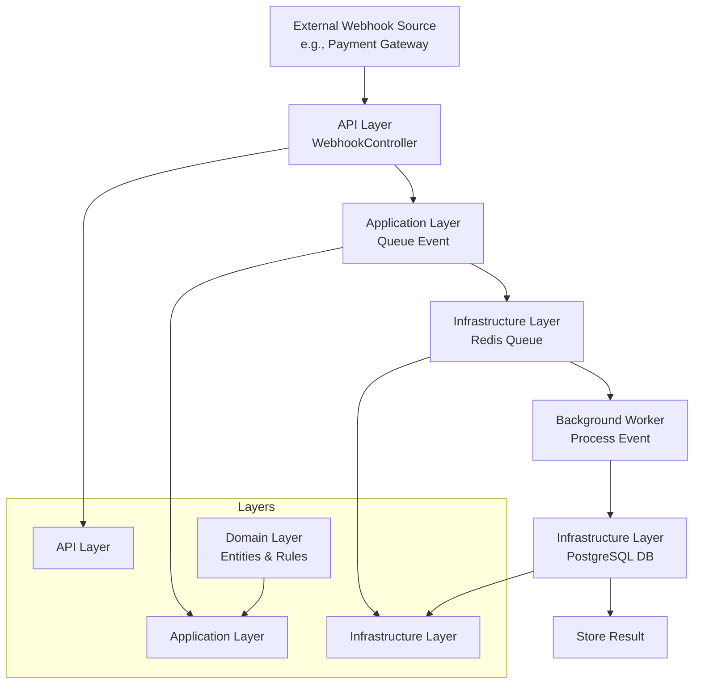
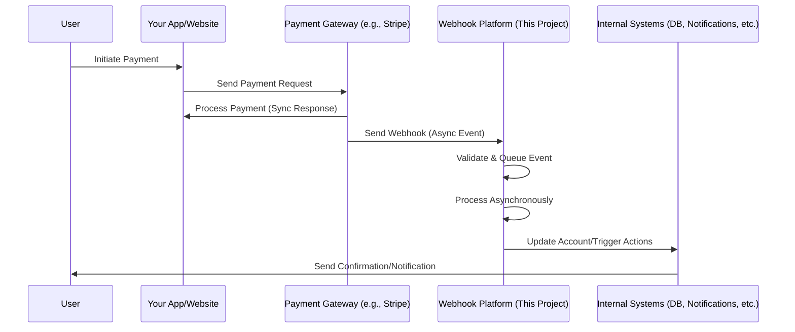

# Webhook Processing Platform

A .NET-based platform for receiving, queuing, and asynchronously processing webhooks, with a focus on payment gateway integrations (e.g., Stripe-like services). Built to demonstrate layered architecture, event-driven design, and coding patterns like Repository, Adapter, and Builder.

## Architecture Overview

- **Layered Architecture**: Separates API, Application, Domain, and Infrastructure layers for maintainability.
- **Event-Driven**: Webhooks trigger events that are queued and processed in the background.
- **Async Processing**: Uses background workers to handle high-volume webhook events without blocking.
- **Patterns**: Repository for data access, Adapter for external integrations, Builder for object construction.

### High-Level Architecture Diagram



This diagram shows the flow of a webhook from receipt to storage, with layers for separation of concerns.

## Role in Larger Systems

This webhook processing platform acts as a middleware component in distributed systems, particularly in e-commerce, fintech, or SaaS applications. It bridges external services (e.g., payment gateways) with internal systems, ensuring reliable event handling without coupling.

### Example: Payment Processing System



This sequence shows how the webhook platform integrates as middleware, handling async events from external services while your main app focuses on user interactions.

In a complete system, this platform reduces load on main APIs, enables scalability, and provides audit trails. It can integrate with microservices via APIs or message buses.

## Technologies

- .NET Web API
- PostgreSQL (for storing results)
- Redis (for queuing; in-memory for development)
- Docker (for containerization)

## Configuration & Secrets

**⚠️ Important:** Never commit sensitive data to version control. This project uses:

- **User Secrets** (`dotnet user-secrets`) for local development - stored securely outside the repo
- **Environment Variables** for production deployments
- **appsettings.json.example** - template showing the required configuration structure

See the Setup section below for how to configure your local environment.

## Setup

1. **Clone the repository:**

   ```bash
   git clone <repository-url>
   cd webhook_processing_platform
   ```

2. **Install .NET 10.0 SDK** from [dotnet.microsoft.com](https://dotnet.microsoft.com)

3. **Set up PostgreSQL and Redis** (via Docker or locally)

4. **Configure local secrets:**
   - Copy `appsettings.json.example` to understand the structure
   - Use .NET User Secrets for local development (secrets are NOT committed to git):
     ```bash
     dotnet user-secrets init
     dotnet user-secrets set "ConnectionStrings:DefaultConnection" "Host=localhost;Database=postgres;Username=postgres;Password=your-password;SSL Mode=Require;Trust Server Certificate=true"
     dotnet user-secrets set "WebhookSignatureSecret" "your-webhook-secret-here"
     ```
   - Or set environment variables in your shell/IDE for the same keys

5. **Run database migrations:**
   ```bash
   dotnet ef database update
   ```

## Running the Application

1. Build and run the API:

   ```bash
   dotnet run
   ```

2. Send test webhooks to `/webhook/incoming` (use tools like Postman or curl)

3. Monitor background processing and stored results via logs or database queries

## Learning Goals

This project helps build skills in:

- System design and architecture.
- Asynchronous programming and queuing.
- Dependency injection and clean code.
- Testing and deployment.

## Future Enhancements

- Real payment gateway integration.
- Idempotency and error handling.
- Dashboard for monitoring.
